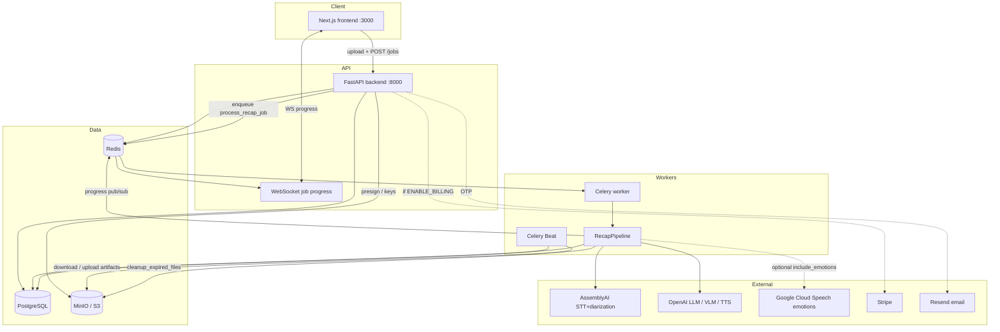

# Architecture

Concrete system map for **Video Recap Agent**: runtime services, external APIs, enrichment + recap pipeline, and which model runs where.

Related: [TECH_STACK.md](TECH_STACK.md) (tool-by-tool notes), [docs/RECAP_PIPELINE_WORKFLOW.md](docs/RECAP_PIPELINE_WORKFLOW.md) (upload→download flow), [backend/ENV_VARIABLES.md](backend/ENV_VARIABLES.md) (env reference).

---

## 1. System inventory

### 1.1 Runtime (Docker Compose)

Defined in `docker-compose.yml` (+ `docker-compose.dev.yml` / `prod` / `staging` overlays).

| Component | Compose service | Role | Open source? |
|-----------|-----------------|------|--------------|
| **Next.js frontend** | `frontend` | Upload UI, jobs, billing, settings; WebSocket progress | Yes (Next.js / React). App code is this repo. |
| **FastAPI backend** | `backend` | REST `/api/v1/*`, auth, job create, WebSocket fan-out, billing hooks | Yes (FastAPI / Uvicorn). App code is this repo. |
| **Celery worker** | `worker` | Runs `RecapPipeline` (`process_recap_job`); queues `celery`, `processing`, `maintenance` | Yes (Celery). |
| **Celery Beat** | `celery-beat` | Periodic `cleanup_expired_files` (every 6h) | Yes (Celery Beat). |
| **PostgreSQL 16** | `postgres` | Users, jobs, subscriptions, usage, intermediate key metadata | Yes (`postgres:16-alpine`). |
| **Redis 7** | `redis` | Celery broker + result backend + job progress pub/sub | Yes (`redis:7-alpine`). |
| **MinIO** | `minio` | S3-compatible object storage (uploads, intermediates, final MP4) | Yes (`minio/minio`). |
| **MinIO init** | `minio-init` | One-shot bucket create (`video-recaps`) via `minio/mc` | Yes. |

Shared processing code: host `modules/` is bind-mounted into `backend` and `worker`.

### 1.2 Outside Compose (deploy / host)

| Component | Role | Open source? |
|-----------|------|--------------|
| **Nginx** | Reverse proxy (API, WS, frontend, MinIO `/storage`) in staging/prod (`nginx/*.conf`, `DEPLOYMENT.md`) | Yes. |
| **AWS S3** (optional prod) | Same boto3 client as MinIO; swap `S3_*` env | No (managed). |
| **FFmpeg** | Audio extract / clip mux (via moviepy / CLI) | Yes. |
| **Docker Engine** | Orchestrates the stack | Yes (Docker CE) / Docker Desktop (proprietary UI). |

### 1.3 External SaaS / APIs

| Provider | Used for | Open source? | Free credits / free tier |
|----------|----------|--------------|---------------------------|
| **OpenAI** | Recap LLM (clip + narration), translation, scene VLM, LP text attribution, TTS; optional user BYOK | No | **No reliable free API credits** for GPT-4o / TTS in current practice. Prepaid billing (typically **min ~$5**). ChatGPT Plus ≠ API credits. |
| **AssemblyAI** | L0 speech-to-text + **speaker diarization** (`universal-3-pro` / `universal-2`) | No | **$50 free credits** on signup (no card required; one-time). Startup program (separate, application-based) may offer large hour grants. |
| **Google Cloud Speech-to-Text** | Optional **emotion analysis** when job `include_emotions=true` | No | New GCP accounts often get **~$300 credits / 90 days** (see `onetime-setup/`); not unlimited. |
| **Stripe** | Subscriptions / checkout / webhooks | No | Test mode free; live charges real money. Product billing off by default (`ENABLE_BILLING=false`). |
| **Resend** | OTP / signup email | No | Free tier: **3,000 emails/mo**, **100/day**. App skips send if `RESEND_API_KEY` empty. |
| **Google OAuth** | Optional login (`GOOGLE_CLIENT_ID`) | No | Free for standard OAuth client usage. |

### 1.4 Local ML / media libraries (run in worker)

| Library / model | Role | Open source? |
|-----------------|------|--------------|
| **OpenAI Whisper** (`openai-whisper`) | Local STT when AssemblyAI path is off | Yes. |
| **Ultralytics YOLOv11** (`yolo11n.pt`) | Person detection (L2 continuous) | Yes (AGPL for ultralytics; weights as distributed). |
| **ByteTrack** (via `supervision`) | Multi-object tracking (L2 continuous) | Yes. |
| **InsightFace / ArcFace** (`buffalo_l`) | Face embeddings (L2); optional genderage fallback (L3) | Yes. |
| **MediaPipe Face Mesh** | Face detect / lip helpers (lip path **dormant**) | Yes. |
| **HuggingFace `prithivMLmods/Gender-Classifier-Mini`** (SigLIP) | L3 face-crop gender classifier | Yes (model + transformers). |
| **OpenCV** | Frame I/O (L2, L3, scene sampling) | Yes. |
| **moviepy / pydub** | Clip cut, audio strip, final mux | Yes. |

---

## 2. End-to-end workflow

### Job lifecycle (product path)

1. Browser uploads video → **MinIO** (`uploads/{user_id}/…`).
2. `POST /api/v1/jobs` → row in **Postgres**, Celery task on **Redis**.
3. **Worker** downloads video, runs `RecapPipeline`, uploads intermediates under `jobs/{job_id}/…`.
4. Progress: worker → Redis pub/sub → FastAPI WebSocket → UI.
5. Final MP4 → `results/{job_id}/recap_video_with_narration.mp4`; optional delete of original upload.

---

## 3. RecapPipeline steps (worker)

Source: `backend/app/workers/pipeline.py` + `modules/*`.

| Step | Name | Systems | AI? | Model / default | Type | Why this model / tool |
|------|------|---------|-----|-----------------|------|------------------------|
| **0** | Download | MinIO/S3 → local temp | No | — | I/O | Need local file for FFmpeg / CV / STT. |
| **1** | Transcribe | AssemblyAI **or** Whisper; then enrichment | Yes | See §4 L0 | STT (+ diarization) | AssemblyAI for **speakers**; Whisper is local/free fallback. |
| **1b** | Emotions (opt.) | Google Cloud Speech | Yes | `latest_long` (+ heuristics) | STT + emotion features | Premium clip weighting when `include_emotions=true`. |
| **1c** | Enrichment | L1→L2∥LP→L3→L4 | Mixed | See §4 | — | Speaker names, characters, gender, attribution proposals. |
| **2** | Translate (opt.) | OpenAI Chat | Yes | `OPENAI_MODEL` → **`gpt-4o`** | Text→text **LLM** | Keep timings; rewrite segment text. Gated by `ENABLE_TRANSLATION`. |
| **3a** | Scene understanding (opt.) | OpenAI Vision | Yes | `SCENE_VISION_MODEL` → **`gpt-4o`** | Video frames→text **VLM** | Windows from `SCENE_BOUNDARY_MODE=fixed` (time batches) or `pyscenedetect` (shot detect + merge); skip-on-failure. |
| **3b** | Generate recap | OpenAI Chat (2 calls) | Yes | `OPENAI_MODEL` → **`gpt-4o`** | Text→text **LLM** | Call 1 = clip windows; Call 2 = narration script. Uses transcript + cast/gender + **scene_summary**. |
| **4** | TTS | OpenAI Audio | Yes | Job `tts_model` → **`tts-1`**, voice **`nova`** | Text→speech **TTS** | Narration audio for final mux (`tts-1-hd` optional). |
| **5** | Extract clips | moviepy / FFmpeg | No | — | Video edit | Cut/concat selected ranges → `recap_video.mp4`. |
| **6** | Remove audio | moviepy / FFmpeg | No | — | Video edit | Silent bed for narration. |
| **7** | Merge | moviepy / pydub | No | — | A/V mux | Final narrated MP4 → MinIO. |

HITL: after enrichment, job may pause at **`awaiting_enrichment_review`** (gender / review queue) before continuing to scene + recap.

---

## 4. Enrichment layers (inside step 1)

Runs only when AssemblyAI-enhanced transcript is present (`ENABLE_ASSEMBLYAI_DIARIZATION` + key). Registry: `backend/app/enrichment/registry.py`. Logic: `modules/enrichment/`.

| Layer | Sublayer | AI / compute | Model / default | Type | Why |
|-------|----------|--------------|-----------------|------|-----|
| **L0** | Transcribe | AssemblyAI API | `speech_models=["universal-3-pro","universal-2"]`, `speaker_labels=True` | Audio→text **STT** + diarization | Speaker labels A/B/C required by later layers. |
| **L1** | Normalize | None | — | Deterministic | Stable utterance IDs / schema. |
| **L2.S1** | Video characters | Local CV (preferred) | **YOLOv11n** + **ByteTrack** + **ArcFace `buffalo_l`** (`L2_CHARACTER_TRACKING=continuous`) | Video→tracks **CV** | Continuous on-screen people; **observe-only** (does not rewrite who spoke). |
| **L2.S1** | Sparse fallback | Local CV | InsightFace / MediaPipe / histogram | Image→embeddings **CV** | Utterance-timed face samples if continuous deps fail. |
| **L2.S2** | Text names | None | Regex / dialogue patterns | Text rules | Self-intro / vocative name binding. |
| **LP.S1** | Text context | OpenAI Chat | `GPT_MODEL` → **`gpt-4o-mini`** | Text→text **LLM** | Dialogue act, mood, addressee hints (cheaper/faster than gpt-4o). |
| **LP.S2** | Visual fusion | None | Co-occurrence rules | Deterministic | Visual votes for attribution; **no lip overwrite**. |
| **LP.S3** | Fuse | None | `fuse_speaker_prediction` | Deterministic | `speaker_predicted` + `pending_review` (does not auto-overwrite `speaker`). |
| **L3.S1** | Text gender | None | Lexicons / pronouns | Deterministic | Text gender evidence. |
| **L3.S2** | Visual hints | None | Portrait alignment | Deterministic | No face-gender ML here. |
| **L3.S3** | Frame gender | Local classifier | **`Gender-Classifier-Mini`** (SigLIP); InsightFace genderage fallback | Image→label **classifier** | Face crops near speech windows. |
| **L4** | Finalize | None | Merge + review queue | Deterministic | Pronoun hints + HITL queue for narration. |

**Parallelism:** L2 and LP.S1 can run concurrently (`backend/app/enrichment/pipeline.py`).

### Explicitly not wired

| Path | Status |
|------|--------|
| Lip / speaking-face → rewrite `utterance.speaker` | **Skipped** — on-screen ≠ speaker; collapses diarization (`face_analysis.py`, `reconcile.apply_visual_utterance_corrections`). |
| L2 appearance describe (`gpt-4o-mini` vision) | Code exists; **not** called on product L2 path. |

---

## 5. AI model map (by modality)

| Model | Provider | Modality | Kind | Where used | Why chosen here |
|-------|----------|----------|------|------------|-----------------|
| **AssemblyAI universal-3-pro / universal-2** | AssemblyAI | Audio → text (+ speakers) | Cloud **STT** | L0 | Production diarization quality; speaker labels for enrichment. |
| **Whisper `small`** (job-configurable) | Local (OpenAI weights) | Audio → text | Local **STT** | Fallback / legacy CLI | Free local STT; no speakers unless other stack added. |
| **gpt-4o** | OpenAI | Text → text | **LLM** | Recap clip + narration; translation | Strong instruction-following for editor/scriptwriter prompts. |
| **gpt-4o** | OpenAI | Image(s) → text | **VLM** | Scene understanding | Frame batches → visual narrative for recap grounding. |
| **gpt-4o-mini** | OpenAI | Text → text | **LLM** | LP.S1 attribution context | Lower cost/latency for batch utterance tagging. |
| **tts-1** / **tts-1-hd** | OpenAI | Text → audio | **TTS** | Narration MP3 | Product voiceover; `nova` default voice. |
| **Google `latest_long`** | GCP Speech | Audio → text + emotion features | Cloud **STT** + analytics | Optional emotions | Premium emotional intensity for clip ranking. |
| **YOLOv11n** | Ultralytics (local) | Frame → boxes | **Object detector** | L2 continuous | Fast person detection. |
| **ByteTrack** | Local | Boxes → track IDs | **Tracker** | L2 continuous | Temporal identity across frames. |
| **ArcFace buffalo_l** | InsightFace (local) | Face crop → embedding | **Face recognition** | L2 identity | Cluster same person across shots. |
| **Gender-Classifier-Mini** | HF (local) | Face crop → gender | **Image classifier** | L3.S3 | Lightweight gender proposal for review. |

Env knobs: `OPENAI_MODEL`, `GPT_MODEL`, `SCENE_VISION_MODEL`, `WHISPER_MODEL_SIZE`, job `tts_model` / `tts_voice` — see [backend/ENV_VARIABLES.md](backend/ENV_VARIABLES.md).

---

## 6. Data stores & keys

| Store | What lives there |
|-------|------------------|
| **Postgres** | Users, JWT sessions metadata, `recap_jobs` (status, `config`, `intermediate_keys`, S3 keys) |
| **Redis** | Celery queues, task results, Whisper cache invalidation, progress channels |
| **MinIO/S3** | `uploads/…`, `jobs/{job_id}/…` (transcription, enrichment layers, scene, recap_data, TTS, clips), `results/{job_id}/recap_video_with_narration.mp4` |

---

## 7. Feature flags that change the graph

| Flag / config | Effect if off / default |
|---------------|-------------------------|
| `ENABLE_ASSEMBLYAI_DIARIZATION=false` | No L0 speakers → enrichment skipped |
| `ENABLE_SCENE_UNDERSTANDING=false` | No VLM scene; recap uses transcript (+ cast/gender) only |
| `ENABLE_TRANSLATION=false` | Step 2 skipped |
| `include_emotions=false` (job) | No Google emotion path |
| `ENABLE_BILLING=false` | Quotas not enforced |
| `L2_CHARACTER_TRACKING=sparse` | Skip YOLO/ByteTrack; utterance face samples only |
| `MAX_TARGET_DURATION_SECONDS` | Caps upload form + `JobConfig` (default **300**) |

---

## 8. Local vs product paths

| Path | Entry | Enrichment | Scene | Jobs / S3 / UI |
|------|-------|------------|-------|----------------|
| **Product** | Docker UI → Celery `RecapPipeline` | Yes (if AssemblyAI) | Optional | Yes |
| **Enrichment CLIs** | `scripts/enrichment/*` | Same `modules/enrichment` | `run_scene_understanding.py` | No |
| **Legacy Whisper CLI** | `run_recap_workflow.py` | No | No | No |

---

## 9. Ports (local `make dev`)

| Service | Host port (default) |
|---------|---------------------|
| Frontend | 3000 |
| Backend API | 8000 |
| MinIO API / console | 9000 / 9001 |
| Postgres | 5434 → 5432 |
| Redis | 6380 → 6379 |
