# Tech Stack

What we use, where it runs, and what it produces. Each section ends with a **micro workflow**; the **master workflow** chains them at the end.

---

## Frontend — upload, monitor, download

| Tech | Role in project | Output enhancement | Example |
|------|-----------------|-------------------|---------|
| **Next.js 14** | App Router pages: upload, jobs, billing | Server + client routes; API proxy to backend in Docker | User opens `/upload` → file picker → job created |
| **React 18 + TypeScript** | UI state, typed API contracts | Fewer runtime errors; predictable job status UI | `JobDetailContent` renders step 3 at 45% without guessing types |
| **Tailwind + Radix + shadcn** | Dashboard layout, dialogs, progress | Consistent UI; live step progress bar | `StepProgressWithDownloads` shows 7 steps + per-step downloads |
| **Axios** | REST calls to `/api/v1/*` | Structured errors (quota, auth) surface in toasts | `POST /jobs` returns `job_id` used for WebSocket + polling |
| **WebSocket** (`JobWebSocket`) | Subscribes to `ws/jobs/{id}` | Real-time progress without page refresh | Step changes `Transcribe → Generate recap` updates UI in <1s |
| **Google OAuth** | Optional sign-in | Faster onboarding vs email-only | One-click login → JWT cookie → upload enabled |

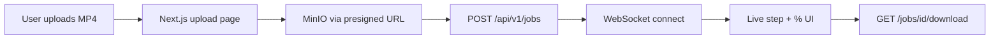

---

## API layer — auth, jobs, billing

| Tech | Role in project | Output enhancement | Example |
|------|-----------------|-------------------|---------|
| **FastAPI** | REST + WebSocket entrypoint | Async I/O; OpenAPI docs at `/docs` | `POST /jobs` validates config, enqueues worker |
| **Pydantic** | Request/response schemas | Invalid `whisper_model` rejected before queue | `target_duration: 30` enforced as int 10–120 |
| **SQLAlchemy (async)** | Job, user, usage models | Durable job state across restarts | Job row: `status=processing`, `current_step=4` |
| **Alembic** | DB migrations | Schema changes without data loss | `003_add_email_verification_fields` |
| **JWT + bcrypt** | Auth | Per-user jobs and API keys | Bearer token scopes `GET /jobs` to owner only |
| **Stripe** | Billing / quota | Paid users get higher job limits | Quota check blocks job when credits exhausted |

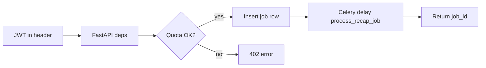

---

## Queue & worker — run the pipeline off-thread

| Tech | Role in project | Output enhancement | Example |
|------|-----------------|-------------------|---------|
| **Celery** | `process_recap_job` task | API returns immediately; 2–10 min work in background | Upload response in ~200ms; processing continues |
| **Redis** | Broker + result backend + pub/sub | Worker scaling; live progress events | `celery,processing,maintenance` queues |
| **Celery Beat** | Scheduled maintenance | Stale job cleanup | Expired outputs removed on schedule |

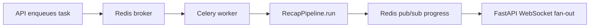

---

## Data & storage — persist inputs, intermediates, results

| Tech | Role in project | Output enhancement | Example |
|------|-----------------|-------------------|---------|
| **PostgreSQL 16** | Jobs, users, intermediates metadata | Resume from last completed step | `intermediate_keys: {transcription: s3://...}` |
| **MinIO (S3)** | Videos, JSON, audio, final MP4 | Large files off DB; CDN-ready keys | `results/{job_id}/recap_video_with_narration.mp4` |
| **boto3** | S3 upload/download in worker | Worker streams 500MB video without filling disk long-term | Temp dir cleaned after upload to `jobs/{id}/` |

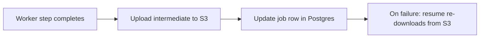

---

## AI & media pipeline — core recap quality

Each step is a micro workflow. Together they produce the final narrated recap.

### Step 0–1: Ingest + transcribe

| Tech | Role | Output enhancement | Example |
|------|------|-------------------|---------|
| **FFmpeg** | Extract audio from video | Whisper gets clean audio input | `tutorial_30min.mp4` → `audio.wav` |
| **Whisper** | Speech → timestamped JSON | Clip selection needs `start`/`end` per phrase | `[{start:0.5, end:5.2, text:"Hello..."}]` |

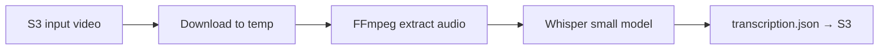

### Step 2: Translate (optional)

| Tech | Role | Output enhancement | Example |
|------|------|-------------------|---------|
| **OpenAI GPT** | Segment-wise translation | Recap/narration in target language while keeping timings | Spanish transcript → English segments, same `start`/`end` |

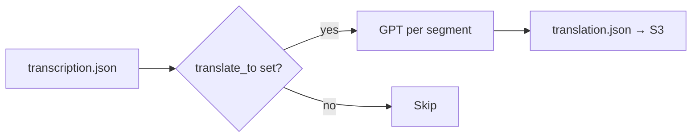

### Step 3: Recap script + clip timings

| Tech | Role | Output enhancement | Example |
|------|------|-------------------|---------|
| **OpenAI GPT** | Clip selection + narration script | 30s recap picks best moments, not random cuts | `clip_timings: [{start:120,end:135}]` + `recap_text` for TTS |
| **validate_clip_timings** | Sanitize LLM output | No overlaps, no zero-length clips → valid MoviePy input | Drops clip past video duration |

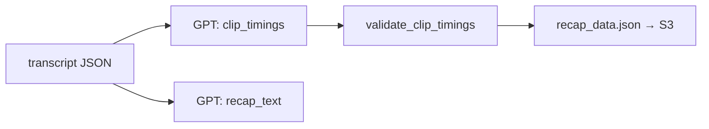

### Step 4–7: Audio, video, merge

| Tech | Role | Output enhancement | Example |
|------|------|-------------------|---------|
| **OpenAI TTS** | `recap_text` → speech | Professional voiceover matched to target duration | `tts-1` + voice `nova` → `narration.mp3` |
| **MoviePy + FFmpeg** | Cut clips, strip audio, mux | Final MP4: selected visuals + new narration only | Silent montage + narration → `recap_video_with_narration.mp4` |

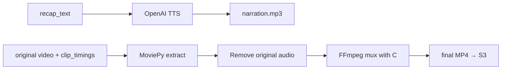

---

## Infra & delivery

| Tech | Role | Output enhancement | Example |
|------|------|-------------------|---------|
| **Docker Compose** | Local/staging full stack | One `make up` runs 8 services | postgres, redis, minio, backend, worker, beat, frontend |
| **Nginx** | Production reverse proxy | TLS + route `/api` and `/` | `videorecap.conf` on VPS |
| **GitHub Actions** | Deploy on push to `main`/`staging` | Repeatable releases | SSH deploy to Hostinger VPS |
| **Resend** | Verification emails | Users can activate accounts | Signup → email link → verified user |

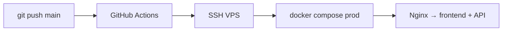

---

## Upload → narrated recap: micro workflows

Each diagram is one slice of the journey. Same `flowchart LR` style throughout.

### MW-1 · Upload video

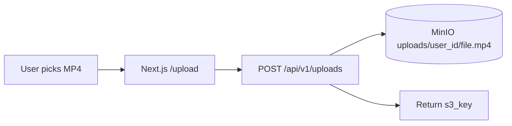

**Example:** `tutorial_30min.mp4` → `uploads/u1/abc/tutorial_30min.mp4`

---

### MW-2 · Create job

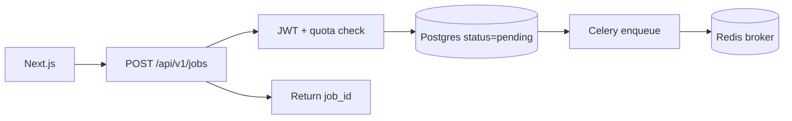

**Example:** Job `job-abc123` created with `target_duration: 30`, `tts_voice: nova`

---

### MW-3 · Queue & orchestrate

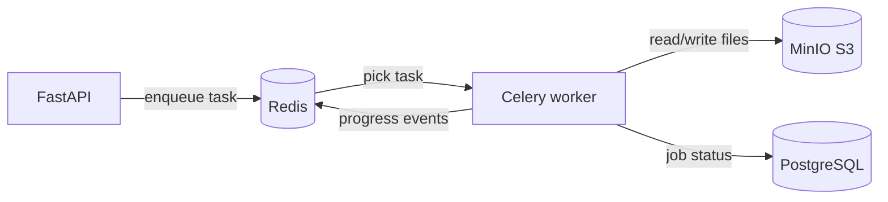

**Example:** API returns in ~200ms; worker runs 2–10 min in background

---

### MW-4 · Live progress to UI

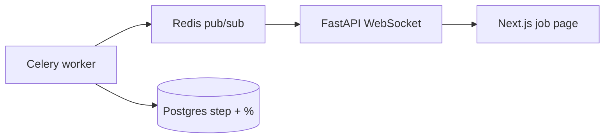

**Example:** UI jumps `Transcribe 15%` → `Generate recap 50%` without refresh

---

### MW-5 · Step 0 — Download input

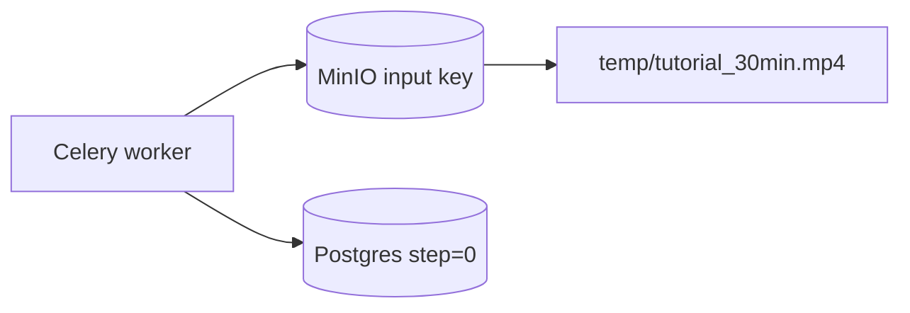

---

### MW-6 · Step 1 — Transcribe

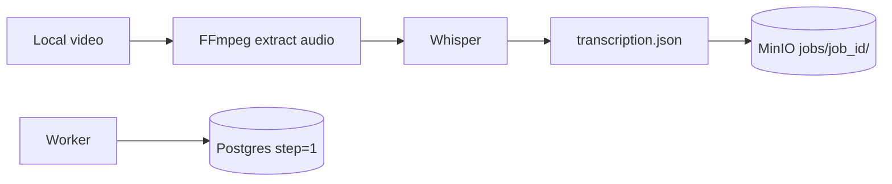

**Example:** `[{start:0.5, end:5.2, text:"Hello everyone..."}]`

---

### MW-7 · Step 2 — Translate (optional)

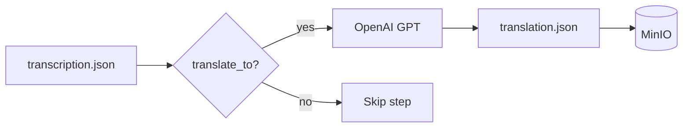

---

### MW-8 · Step 3 — Clips + narration script

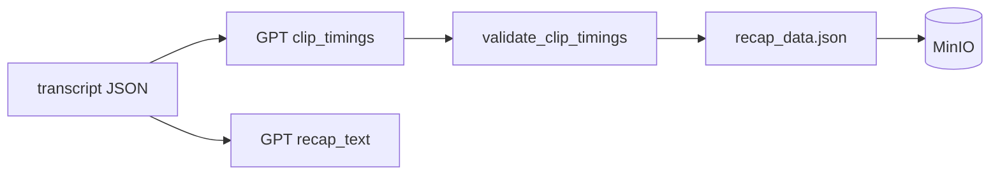

**Example:** 4 clips totalling ~30s + script for TTS

---

### MW-9 · Step 4 — Text-to-speech

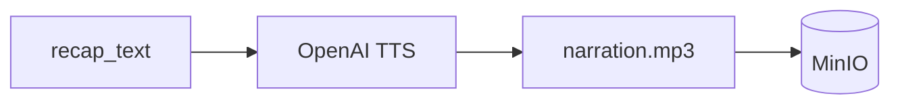

**Example:** `tts-1` + voice `nova` → ~30s audio

---

### MW-10 · Steps 5–7 — Video assembly

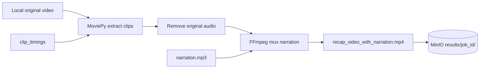

---

### MW-11 · Complete & download

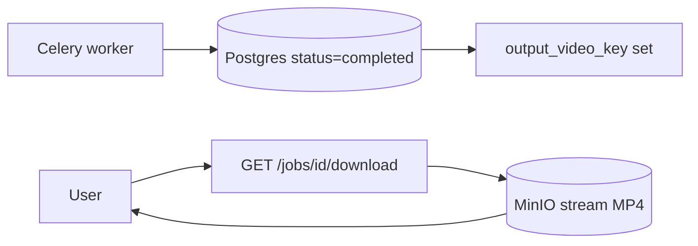

**Example:** User downloads `recap_video_with_narration.mp4` (~30s narrated highlight)

---

## Master workflow (chained)

Each box below is one micro workflow above (MW-1 … MW-11).

```mermaid
flowchart LR
  MW1[MW-1 Upload] --> MW2[MW-2 Create job]
  MW2 --> MW3[MW-3 Queue]
  MW3 --> MW4[MW-4 Live progress]
  MW3 --> MW5[MW-5 Download input]
  MW5 --> MW6[MW-6 Transcribe]
  MW6 --> MW7[MW-7 Translate?]
  MW7 --> MW8[MW-8 Clips + script]
  MW8 --> MW9[MW-9 TTS]
  MW9 --> MW10[MW-10 Video merge]
  MW10 --> MW11[MW-11 Download]
  MW4 -.->|runs in parallel| MW5
```

**Full chain in plain English:**

`tutorial_30min.mp4` uploaded (MW-1) → job `abc-123` created (MW-2) → Celery picks task from Redis (MW-3) → UI shows live % (MW-4) → worker pulls video from MinIO (MW-5) → Whisper JSON transcript (MW-6) → optional GPT translation (MW-7) → GPT picks clips + writes script (MW-8) → TTS `nova` voice (MW-9) → MoviePy cuts + FFmpeg muxes (MW-10) → user downloads final narrated MP4 (MW-11).

---

## Infra & delivery

| Layer | Stack |
|-------|-------|
| UI | Next.js, React, TypeScript, Tailwind, Radix |
| API | FastAPI, Pydantic, SQLAlchemy, Alembic |
| Async work | Celery, Redis |
| Data | PostgreSQL, MinIO/S3 |
| AI | OpenAI (Whisper, GPT, TTS) |
| Media | FFmpeg, MoviePy, pydub |
| Auth & pay | JWT, Google OAuth, Stripe |
| Ops | Docker, Nginx, GitHub Actions |

**Related:** [`CORE_PROCESS_FLOW.md`](./CORE_PROCESS_FLOW.md) (step I/O detail) · [`docs/RECAP_PIPELINE_WORKFLOW.md`](./docs/RECAP_PIPELINE_WORKFLOW.md) (pipeline logic)
